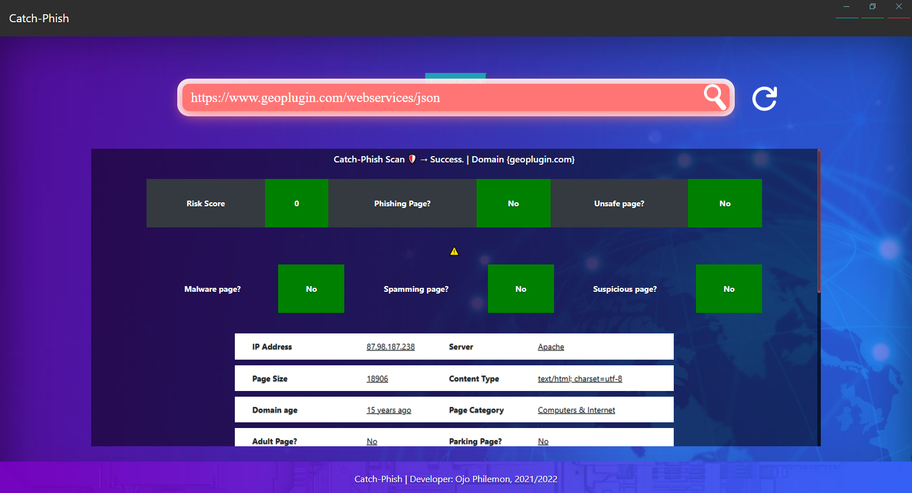
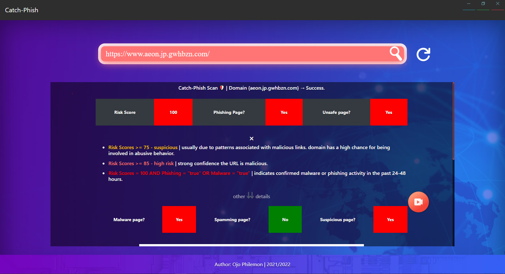

# CatchPhish

A real-time phishing page detection and reconnaissance system built with Electron.js that identifies potentially malicious web pages even as users surf web pages.

## Overview

CatchPhish is a cross-platform desktop application that scans URLs for phishing attempts, malware, and other security risks. It integrates with IPQualityScore's Malicious URL Scanner API to provide comprehensive security analysis including risk scores, domain reputation, SSL certificate validation, and geographical location data. As a whole, CatchPhish comes with a browser extension component that facilitates more real time and convinient webpage analysis, which can be found [here](https://github.com/lemoncode-xo/CatchPhish-Browser-Extension).

## Components
- Desktop Application (This project)
- [Web Browser Extension ](https://github.com/lemoncode-xo/CatchPhish-Browser-Extension)


## Features

- Real-time phishing detection with 95.6% accuracy
- Comprehensive URL security analysis including:
  - Risk score assessment
  - Malware and phishing detection
  - Domain age verification
  - SSL certificate validation
  - Geographical location mapping
  - Content type analysis
- User-friendly interface with detailed security reports
- Export functionality for security analysis results
- Cross-platform support (Windows, macOS, Linux)

## Screenshots




## Requirements


### API Keys Required
- IPQualityScore Malicious URL Scanner API key

## Installation

### Quick Install (Recommended)

Download the latest pre-built installer for your operating system from the [Releases page](https://github.com/lemoncode-xo/CatchPhish/releases/latest).

**Available installers:**
- Windows: `CatchPhish-x.x.x-win32-x64.exe`

After downloading, run the installer and follow the on-screen instructions.
Process to updating your `.env.example` file in your installation directory to contain your IPQualityScore API key as shown [here](#3-configure-api-keys).

### Manual Installation (For Developers)

If you want to build from source or contribute to development:

#### System Requirements
- Node.js (v14.0.0 or higher)
- npm (v6.0.0 or higher)
- Operating System: Windows 7+, macOS 10.10+, or Linux

#### Dependencies

```json
{
  "electron": "Latest stable version",
  "electron-packager": "For packaging",
  "dotenv": "For .env variables support"
}
```

#### 1.  Clone the Repository

```bash
git clone https://github.com/lemoncode-xo/CatchPhish.git
cd CatchPhish
```

#### 2. Install Dependencies

```bash
npm install
```

#### 3. Configure API Keys

1. Rename or duplicate the `.env.example` file in the project root as `.env`
2. Add your IPQualityScore API key:

```javascript
IPQS_API_KEY=your_api_key_here
```

#### 4. Run the application in Development Mode

```bash
npm start
```

## Usage

1. Launch the CatchPhish application
2. Enter a URL in the input field
3. Click "Scan" to analyze the webpage
4. Review the security report including:
   - Risk score and phishing status
   - Domain information and age
   - Server location and IP address
   - SSL certificate status
   - Content analysis
5. Export results as PDF if needed

## Project Structure

```
catchphish/
├── app/
│   ├── css/
│   ├── images/
│   └── js/
├── app.html
├── index.html
├── functions.js
├── main.js
├── package-lock.json
├── package.json
└── start.bat
```

## Key Components

- **main.js**: Main process handling application lifecycle and window management
- **functions.js**: Core logic for API interactions and data processing
- **app.html**: Main application interface
- **index.html**: Application entry point
- **start.bat**: For starting up the application by clicking instead of running npm command on terminal. (Can be used as a shortcut)

## Uninstallation

### Windows

1. Navigate to Control Panel > Programs and Features
2. Find "CatchPhish" in the list
3. Click "Uninstall" and follow the prompts

Alternatively, delete the installation directory and remove any shortcuts.

### Linux

```bash
# If manually installed
rm -rf /path/to/catchphish
rm ~/.config/catchphish  # Remove configuration files
```

## Catch-Phish Browser Extension

CatchPhish also has a [browser extension component](https://github.com/lemoncode-xo/CatchPhish-Browser-Extension) that provides real-time protection while browsing. Installation instructions for the extension can be found [here](https://github.com/lemoncode-xo/CatchPhish-Browser-Extension) while pending its release on the Chrome Web Store.

## Performance

- Average scan time: ~0.7 seconds
- API response time: ~0.68 seconds (99.7% of total process time)
- Memory usage: Optimized for minimal RAM consumption
- No caching to ensure fresh, real-time analysis

## Limitations

- Requires active internet connection
- API rate limits apply based on your IPQualityScore subscription
- Analysis limited to publicly accessible URLs
- Does not support local file analysis

## Contributing

Contributions are welcome. Please submit pull requests or open issues for bugs and feature requests.

## License

This project was developed as part of my final year project at the Federal University of Technology, Akure.

## Acknowledgments

Developed by Ojo Philemon under the supervision of Dr. K. B. Adedeji, Department of Computer Engineering, Federal University of Technology, Akure.

## Support

For issues or questions, please open an issue on GitHub or contact the development team.

## Security Notice

CatchPhish is designed to detect phishing attempts but should be used as part of a comprehensive security strategy. Always exercise caution when visiting unfamiliar websites and submitting sensitive information online.